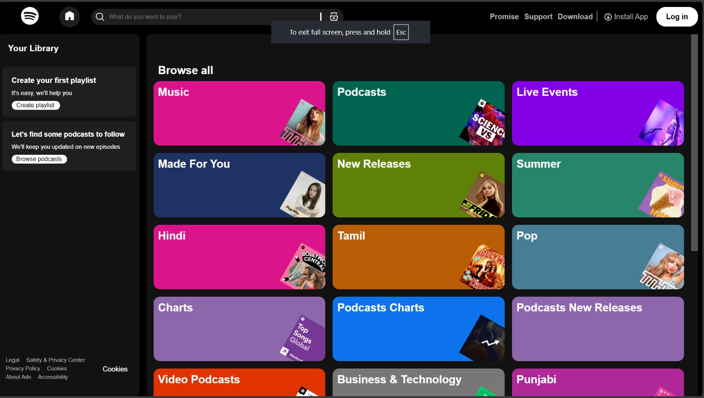

# 🎵 Spotify Clone

A responsive Spotify-inspired music streaming web application built using HTML, CSS, and JavaScript. This project replicates the core UI and music playback experience of Spotify while demonstrating responsive design and JavaScript DOM manipulation.

## 🌐 Live Demo

👉 https://lakshyatomar93.github.io/spotify-clone/

## 📸 Preview



## ✨ Features

- 🎵 Music playback
- ⏯️ Play / Pause controls
- ⏭️ Next & Previous song navigation
- 📊 Interactive seek bar
- 🔊 Volume control
- 📁 Multiple playlists
- 📱 Responsive design for desktop and mobile
- ⚡ Fast and lightweight UI

## 🛠️ Technologies Used

- HTML5
- CSS3
- JavaScript (ES6)
- Git
- GitHub
- GitHub Pages

## 📂 Folder Structure

```text
spotify-clone/
│── index.html
│── style.css
│── script.js
│── preview.png
│── songs/
│── svgfolder/
```

## 🚀 Installation

```bash
git clone https://github.com/lakshyatomar93/spotify-clone.git
```

Open `index.html` using **Live Server** or visit the live demo.

## 🎯 Learning Outcomes

During this project, I learned:

- Responsive web design
- DOM manipulation
- JavaScript event handling
- Audio API
- Git & GitHub
- Deploying projects with GitHub Pages

## 👨‍💻 Author

**Lakshya Tomar**

GitHub: https://github.com/lakshyatomar93